Warning Plugin for Degradation of Software Metrics
===
[](https://www.postech.ac.kr) [](https://www.postech.ac.kr/eng)

**Team 2** ─ Choi Eunsue <sub>@ches7283</sub>, Hanna Mueller <sub>@hmueller</sub>, Gwon Minjae <sub>@mzg00</sub>, Gong Minsu <sub>@gongms</sub>, Noémie Jacquemot <sub>@njacquemot</sub>, Park Subin <sub>@parksbn812</sub>, Kim Namgeon <sub>@namgeon1106</sub>

## 1. Description

### 1.1. Goal

The goal of our project is to warn the user if software metrics of their project degrade or worsen, and to show them which method was the cause of it.

### 1.2. Problem and Solution

While developing software one might focus more on implementing a feature than spending time to make the code easily understandable.
This plugin supports developers by computing the cyclomatic complexity and Halstead metrics per method. If a certain threshold of those metric values is exceeded, the user receives a warning and can check, which methods in what class are exceedings those thresholds. They can then easily navigate to that method in order to validate if that method could be improved.

## 2. Architecture and Design

### 2.1. Database

#### 2.1.1. Environment

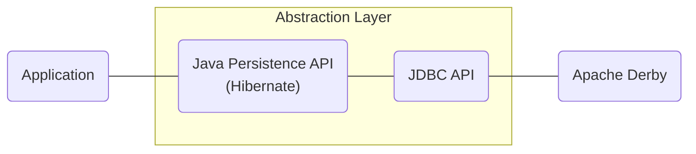
```mermaid
flowchart LR
subgraph Abstraction Layer

f2("Java Persistence API
(Hibernate)") --- f3(JDBC API)
end

f1(Application) --- f2
f3 --- f4(Apache Derby)

```

We use ORM to manage the database, to take advantage of object-oriented programming. Thanks to ORM, we can not only treat each piece of data in the form of an instance but also use the database without writing queries directly. Java uses JPA as a standard ORM specification. We adopted Hibernate, which is its representative implementation, to use JPA. In the `static` block of `HibernateUtil`, initialize JDBC and configure Hibernate. After that, the application can use the ORM by acquiring a DB session from `HibernateUtil`.

#### 2.1.2. Model

> 💡 Getters and setters are omitted in below diagram.

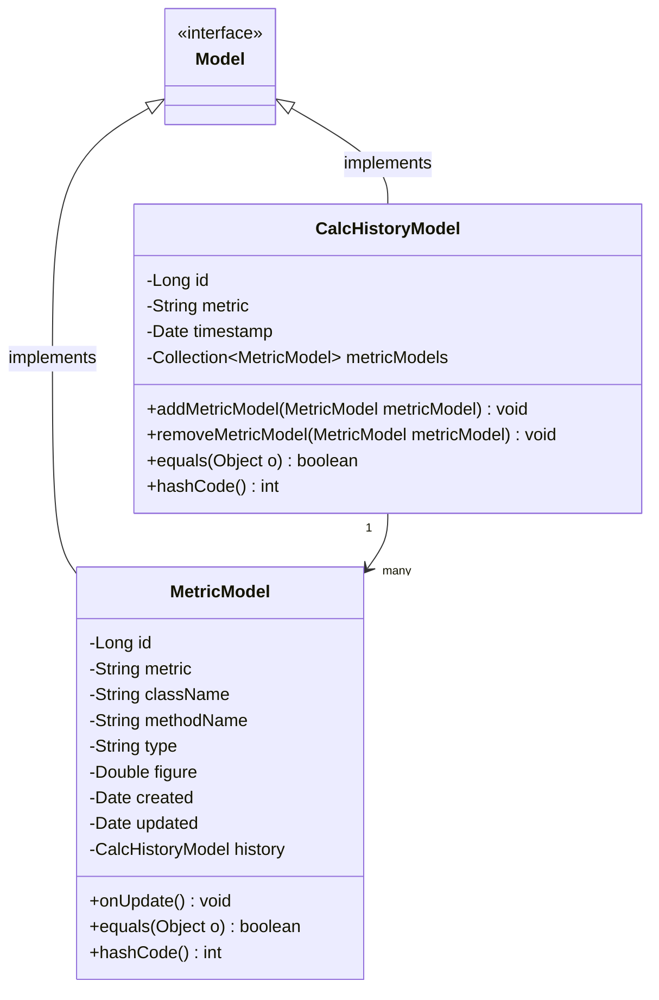
```mermaid
classDiagram
    class Model
        <<interface>> Model
    
    class MetricModel {
        -Long id
        -String metric
        -String className
        -String methodName
        -String type
        -Double figure
        -Date created
        -Date updated
        -CalcHistoryModel history
        +onUpdate() void
        +equals(Object o) boolean 
        +hashCode() int
    }
    
    class CalcHistoryModel {
        -Long id
        -String metric
        -Date timestamp
        -Collection~MetricModel~ metricModels
        +addMetricModel(MetricModel metricModel) void 
        +removeMetricModel(MetricModel metricModel) void 
        +equals(Object o) boolean 
        +hashCode() int 
    }
    
    Model <|-- MetricModel : implements
    Model <|-- CalcHistoryModel : implements
    CalcHistoryModel "1" --> "many" MetricModel
```

##### MetricModel

| id  | metric  | class  |  method  | type | figure | history  |
|:---:|:-------:|:------:|:--------:|:----:|:------:|:--------:|
|  1  |  Cyclo  | classA | methodAA |  c   |   2    | a-pp-le  |
|  2  |  Cyclo  | classA | methodAB |  c   |   3    | a-pp-le  |
|  3  |  Cyclo  | classB | methodBA |  c   |   5    | a-pp-le  |
|  4  |  Cyclo  | classA | methodAA |  c   |   7    | ba-na-na |
|  5  |  Cyclo  | classA | methodAB |  c   |   0    | ba-na-na |
|  6  |  Cyclo  | classB | methodBA |  c   |   91   | ba-na-na |
|  7  | Halsted | classA | methodAA |  a   |   10   |  c-a-t   |
|  8  | Halsted | classA | methodAA |  b   |   2    |  c-a-t   |
|  9  | Halsted | classA | methodAA |  c   |   3    |  c-a-t   |
| 10  | Halsted | classA | methodAA |  d   |   5    |  c-a-t   |
| ... |   ...   |  ...   |   ...    | ...  |  ...   |   ...    |

`MetricModel` is a database model for recording metrics. We implemented this model to store numbers according to metrics, classes, methods, and types. Most field names are intuitive, but some namings are not. Those are `type` and `history`. First, `type` is a field for the metrics which have several numerical values in one metric. For example, Halsted complexity returns four types of the calculation result. Therefore, we additionally introduce a type field to record it separately. Second, the `history` field represents a many-to-one relationship with `CalcHistoryModel`. It is necessary to manage the metrics generated through the same calculation attempt since the calculation generates results for each method. For this, we introduce the `history` field to group each metric calculated together into the same group.


##### CalcHistoryModel

|    id    | metric  | timestamp | metricModels |
|:--------:|:-------:|:---------:|:------------:|
| a-pp-le  |  Cyclo  |  11 pm.   |   1, 2, 3    |
| ba-na-na |  Cyclo  |  12 pm.   |   4, 5, 6    |
|  c-a-t   | Halsted |  09 pm.   | 7, 8, 9, 10  |
|   ...    |   ...   |    ...    |              |

`CalcHistoryModel` is a database model for storing calculation history. It groups the `MetricModel`s generated by the calculation of each metric and records the time. In this case, `metricModels` is a field in a one-to-many relationship with `MetricModel`.


#### 2.1.2. Service


> 💡 Getters and setters are omitted in below diagram.


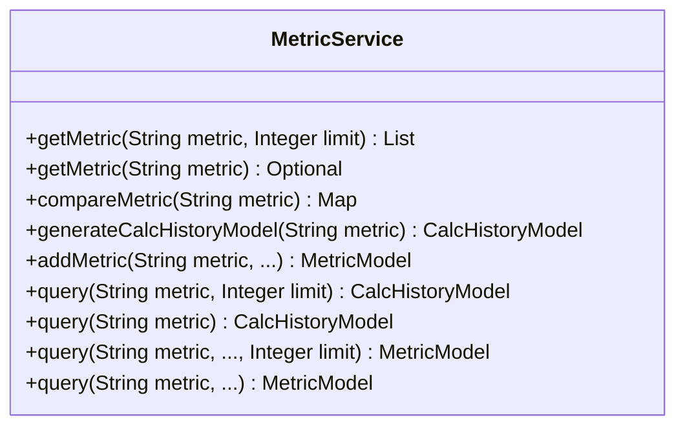
```mermaid
classDiagram
	class MetricService {
        +getMetric(String metric, Integer limit) List
        +getMetric(String metric) Optional
        +compareMetric(String metric) Map
        +generateCalcHistoryModel(String metric) CalcHistoryModel
        +addMetric(String metric, ...) MetricModel
        +query(String metric, Integer limit) CalcHistoryModel
        +query(String metric) CalcHistoryModel
        +query(String metric, ..., Integer limit) MetricModel
        +query(String metric, ...) MetricModel
    }
    
```

`MetricService` defines various helper methods for interacting with database. There are 4 main functions in this class.

##### Get from database
`getMetric` and `query` methods gets metric data from database. Methods with `limit` at the end of parameter gets multiple data(max size of `limit`) and return `List`(if many) or `Optional`(if one).

###### getMetric()

`getMetric()` methods gets `MetricModel` data with metric name `metric` and convert the data into `Map<String, Map<String, Map<String, Double>>>`. The map can be understood as `Map<"Class name", Map<"Method name", Map<"Type", "Figure">>>`.

###### query()

`query()` methods with more than two parameters return `MetricModel` data from database. Parameters are `metric`, `className`, `methodName`, `type`, `history`, and `limit`. Any parameter could be null. If all parameters are null, this method returns all `MetricModel` data stored in database, in descending order by `created`. If a parameter is not null, data is filtered by that parameter using `criteria.where()`. For example, if `className` was `ExampleClass`, then only the data about `Exampleclass` is returned.
`query()` methods with only one or two parameters return `CalcHistoryModel` data from database. The algorithm works same as above one.

##### Save to database
###### addMetric()

`addMetric()` method creates a new `MetricModel` with input metric data and save it to database and return it.

##### Generate new CalcHistoryModel
###### generateCalcHistoryModel()

`generateCalcHistoryModel()` method simply generates a new `CalcHistoryModel` and return it. Returned object will be used to save and get `MetricModel`.

##### Compare new data with old one
###### compareMetric()

`compareMetric()` gets two most recent metric data which metric name is given `metric`, and return the difference of figure between two of them (old - new).

###### About MetricModelService...

There is a class called `MetricModelService`. This class is initial desgin of database service class, but after `BaseMetric` was implemented, we created new one for `BaseMetric`. `MetricModelService` is only used for code line metric now. Algorithm is similar, so we will omit it.

### 2.2. Metric

#### 2.2.1. Visiting Metric (@Minjae)

> 💡 Getters and setters are omitted in below diagram.

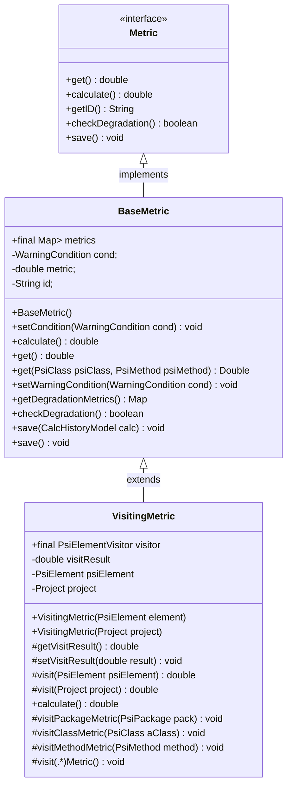
```mermaid
classDiagram
    class Metric {
        +get() double 
        +calculate() double 
        +getID() String 
        +checkDegradation() boolean 
        +save() void
    }
    
	class BaseMetric {
		+final Map<String, Map<PsiMethod, Double>> metrics
		-WarningCondition cond;
		-double metric;
		-String id;
		+BaseMetric()
		+setCondition(WarningCondition cond) void
		+calculate() double
		+get() double 
		+get(PsiClass psiClass, PsiMethod psiMethod) Double 
		+setWarningCondition(WarningCondition cond) void 
		+getDegradationMetrics() Map
		+checkDegradation() boolean 
		+save(CalcHistoryModel calc) void 
		+save() void
    }
    
    class VisitingMetric {
        +final PsiElementVisitor visitor
        -double visitResult
        -PsiElement psiElement
        -Project project
        +VisitingMetric(PsiElement element)
        +VisitingMetric(Project project)
        #getVisitResult() double
        #setVisitResult(double result) void
        #visit(PsiElement psiElement) double
        #visit(Project project) double
        +calculate() double
        #visitPackageMetric(PsiPackage pack) void
        #visitClassMetric(PsiClass aClass) void
        #visitMethodMetric(PsiMethod method) void
        #visit(.*)Metric () void
    }
    
    <<interface>> Metric
    Metric <|-- BaseMetric : implements
    BaseMetric <|-- VisitingMetric : extends
```

`VistingMetric` is implemented to provide a template for exploiting Intellij PSI. This class provides a basic template for traversing packages with `PsiElementVisitor` and calculating metrics.

##### Structure

###### Visitor
```java 
final public PsiElementVisitor visitor = new JavaElementVisitor() {
    @Override
    public void visitDirectory(@NotNull PsiDirectory dir) {
        // Logics to visit all packages in directory.
    }
    
    @Override
    public void visitPackage(PsiPackage pack) {
        visitPackageMetric(pack);
    }
    
    // ...
}
```

`visitor` is an instance that actually performs visiting. This instance exists in the form of an anonymous class that extends `JavaElementVisitor`. We have overridden all methods provided by `JavaElementVisitor`, and each visit method is implemented to call the corresponding external visit virtual method. Additionally, `visitor` includes the ability to search for the highest-level packages in the `visitDirectory` method.

```java 
private double visitResult = 0;
```

Each method of `visitor` does not return a value, but there is a need to share a value among visit methods. For this, we introduced the `visitResult` variable. Each visit method accumulates the calculation result through this variable.

###### Entrypoint

```java 
private PsiElement psiElement;
private Project project;
```

`psiElement` and `project` are entrypoints allocated by the constructor. Visiting calculates the metric starting with the non-null one of them.

##### Algorithm

###### Visiting

`Visiting` is realized through `visit()` method. When the `visit ()` method is called from the outside with the PSI object, the visiting process is executed by accepting the `visitor` from given element <sub>or project</sub>. Now, what we need to pay attention to is how visitng's internal logic is implemented. As mentioned earlier, the `visit` methods of `visitor` have corresponding external `visit` methods. For example, `visitClass()` in `visitor` calls `visitClassMetric()`. Therefore, subclasses of `VisitingMetric` can customize the visiting logic by overriding `visit(.*)Metric()` methods.

###### Calculating

Thanks to `visitor`, which has great versatility, we implemented calculating without much effort. We implemented the computational process to simply call `visit ()` from the instance's entrypoints<sub>`psiElement` or `project` </sub> and store the final result of that process.


#### 2.2.2. Codeline Metric

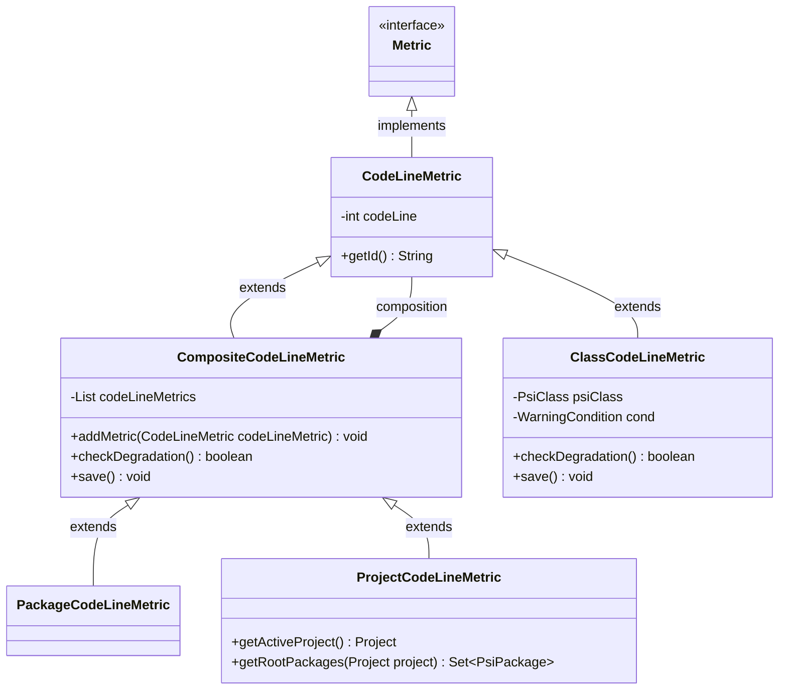
```mermaid
classDiagram
		class Metric{

		}
		
		class CodeLineMetric {
				-int codeLine
				+getId() String
		}
		
		class CompositeCodeLineMetric {
				-List<CodeLineMetric> codeLineMetrics
				+addMetric(CodeLineMetric codeLineMetric) void
				+checkDegradation() boolean
				+save() void
		}
		
		class PackageCodeLineMetric {

		}
		
		class ProjectCodeLineMetric {
				+getActiveProject() Project
				+getRootPackages(Project project) Set~PsiPackage~
		}

    class ClassCodeLineMetric {
        -PsiClass psiClass
        -WarningCondition cond
        +checkDegradation() boolean
				+save() void

    }
    
    <<interface>> Metric
    Metric <|-- CodeLineMetric : implements
    CodeLineMetric <|-- ClassCodeLineMetric : extends
    CompositeCodeLineMetric *-- CodeLineMetric : composition
    CodeLineMetric <|-- CompositeCodeLineMetric : extends
    CompositeCodeLineMetric <|-- PackageCodeLineMetric : extends
    CompositeCodeLineMetric <|-- ProjectCodeLineMetric : extends
```

##### Structure

`CodeLineMetric` implements interface `Metric`. We use `ProjectCodeLineMetric`, `PackageCodeLineMetric`, and `ClassCodeLineMetric` for counting each code lines of project, package, and class. `ProjectCodeLineMetric` and `PackageCodeLineMetric` extend `CompositeCodeLineMetric` which holds `List<CodeLineMetric>`as field.

##### Algorithm

Opened project parsed to `ProjectCodeLineMetric` with `getActiveProject()`. Then using `getRootPackages()` and `addMetric()`, `PackageCodeLineMetric` per each subPackages add to codeLineMetrics of `ProjectCodeLineMetric`. Similarly, each classes and subPackages of package add to `codeLineMetrics` of `PackageCodeLineMetric` at it's creation.

In `calculate()` of `ClassCodeLineMetric`, getting `String` form of Metric's `PsiClass`, dividing and counting based on line break calculate lines of class. Furthermore, in `CompositeCodeLineMetric`, simply calling and summing up each returns of `CodeLineMetric`'s `calculate()` in `codeLineMetrics` calculate lines of package or project.

#### 2.2.3. Halstead Metric

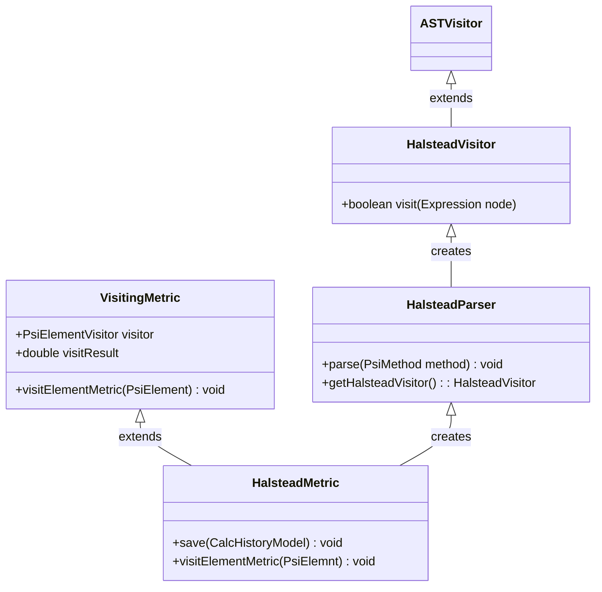
```mermaid
classDiagram
    class VisitingMetric {
        +PsiElementVisitor visitor
        +double visitResult
        +visitElementMetric(PsiElement) void
        }
    
	class HalsteadMetric {
		+save(CalcHistoryModel) void
        +visitElementMetric(PsiElemnt) void
    }
    
     
	class HalsteadParser {
        +parse(PsiMethod method) void 
        +getHalsteadVisitor(): HalsteadVisitor 
    }
    
    
	class HalsteadVisitor {
        +boolean visit(Expression node) 
    }
    
    class ASTVisitor {
    }
    
    VisitingMetric <|-- HalsteadMetric : extends
    ASTVisitor <|-- HalsteadVisitor : extends
    HalsteadVisitor <|-- HalsteadParser : creates
    HalsteadParser <|-- HalsteadMetric : creates
```

##### Structure

`HalsteadMetric` is created by extending from VisitingMetric. It leverages `visitElemenMetric(PsiElement)`for visiting packages, classes and methods. For counting the total and unique numbers of operands and operators, we use `HalsteadVisitor` extending `org.eclipse.jdt.core.dom.ASTVisitor` in order to visit PrefixExpression, PostfixExpressions, etc. and `HalsteadParser` to parse the PsiMethod.

##### Algorithm

When visiting and parsing all methods, we calculate the following four values:

- $N_1$
    - `numberTotalOperators`
- $n_1$
    - `numberUniqueOperators`
- $N_2$
    - `numberTotalOperands`
- $n_2$
    - `numberUniqueOperands`


We can then calculate thes values for Halstead Metrics, however only four of them are shown in GUI, namely `VOCABULARY`, `VOLUME`, `DIFFICULTY`and `EFFORT`. We are using `HalsteadMetricCalculator` for that:

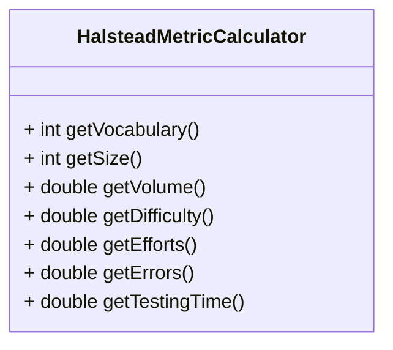
```mermaid
classDiagram
    class HalsteadMetricCalculator {
        + int getVocabulary() 
        + int getSize() 
        + double getVolume() 
        + double getDifficulty() 
        + double getEfforts()
        + double getErrors()
        + double getTestingTime() 
    }
```


#### 2.2.4. Cyclomatic Metric

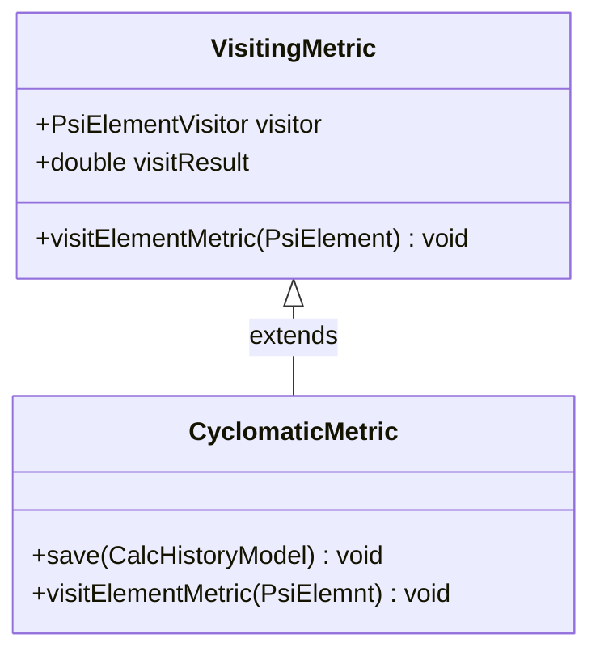
```mermaid
classDiagram
    class VisitingMetric {
        +PsiElementVisitor visitor
        +double visitResult
        +visitElementMetric(PsiElement) void
        }
    
	class CyclomaticMetric {
		+save(CalcHistoryModel) void
        +visitElementMetric(PsiElemnt) void
    }
    
    
    VisitingMetric <|-- CyclomaticMetric : extends
```

##### Structure
`CyclomaticMetric` is created by extending from VisitingMetric. It uses visitor pattern of VisitingMetric. Also __Psi(Program structure interface)__ which provide __Abstract Syntax Tree__ of java code by parsing is used for calculation of Cyclomatic Metric. We implemented each visitElement function (i.e. visitClassMetric, visitIfStatementMetric) to invoke psi-visit function.


##### Algorithm
Definition of Cyclomatic Complex is `#branch + 1`. so, we define the branch are
- If / Else-If
- Switch-case (# of each cases except default)
- Assert statement
- Try-catch
- Conditional operatior (i.e. `x = y > 3 ? a : b`)
- While / Do-while
- For / Foreach

```java
    @Override
    protected void visitIfStatementMetric(PsiIfStatement statement) {
        setVisitResult(getVisitResult() + 1);

        requireNonNullElse(statement.getCondition()).accept(visitor);
        requireNonNullElse(statement.getThenBranch()).accept(visitor);
        requireNonNullElse(statement.getElseBranch()).accept(visitor);
    }
```
For exmaple, like above code we override all of visitFunction. if visitor visit some function related branch statement, we add the branch count. Then, accept visitor for child statement of that.


#### 2.2.5 Warning System
##### ProjectToolWindow
###### Constructor
```java
// ...
ActionListener calculateAndSaveListener = e -> backgroundOperation(() -> {
    doMetricsCalculation(popupBuilder, window);
    doMetricsSave();
});

buttonCalcAndSave.addActionListener(calculateAndSaveListener);
// ...
```

In the constructor of `ProjectToolWindow`, an `ActionListener` is added to the 'Calculate Metrics' button. When a user clicks this button, this `ActionListener` is executed, so all the values are calculated and saved automatically.

###### doMetricsCalculation()
```java
private void doMetricsCalculation(..., MetricWindow window) {
    ArrayList<Metric.Type> warnMetric = new ArrayList<Metric.Type>();

    for (Metric.Type metric : Metric.Type.values()) {
        boolean warning = false;

        Metric[] subMetrics = metricList.get(metric);
        for (Metric subMetric : subMetrics) {
            subMetric.calculate();
            warning = warning || subMetric.checkDegradation();
        }
        if (warning) {
            warnMetric.add(metric);
        }
    }

    //...
    
    window.setMetrics(warnMetric);
}
```

This method is responsible for calculating & warning. Each `Metric` object calls `calculate()` and `checkDegradation()` to calculate and check if there is any degraded value in each `Metric`. In `setMetrics()` of `MetricWindow`, each `BaseMetric` object calls `getDegradedMetrics()` method.

##### BaseMetric
###### getDegradedMetrics()
```java
public Map<String, Set<PsiMethod>> getDegradationMetrics() {
    Map<String, Set<PsiMethod>> degradedMetrics = new HashMap<>();

    Collection<MetricModel> metricModels = MetricService.query(getID(), 1)
                                                        .get(0).getMetricModels();
    
    for (String psiClass : metrics.keySet()) {
        for (PsiMethod psiMethod : metrics.get(psiClass).keySet()) {
            // ...
            List<MetricModel> subMetricModels = // ...

            Double newValue = metrics.get(psiClass).get(psiMethod);
            Double oldValue;
            if (subMetricModels.isEmpty()) {
                oldValue = newValue;
            } else {
                oldValue = subMetricModels.get(0).getFigure();
            }

            if (cond.shouldWarn(oldValue, newValue)) {
                degradedMetrics.putIfAbsent(psiClass, new HashSet<>());
                degradedMetrics.get(psiClass).add(psiMethod);
            }
        }
    }

    return Collections.unmodifiableMap(degradedMetrics);
}
```

In each `BaseMetic` object, this method returns all the degraded classes and methods. In order to check if they are degraded, the current value can be compared to the latest value in database or to the fixed threshold for each metric type. With the returned `Map` of all the degraded classes and methods, `MetricWindow` object can highlight all the degraded values.

### 2.3. GUI

The user can interact with our plugin the following ways:
* Show and hide the plugin side panel.
* Click on the button 'Calculate Metrics' in the side panel.
* Hovering to get metric descriptions.
* Use scrollbar if table size exceeds window size.

#### 2.3.1 The plugin side panel

The plugin side panel is represented by the class `ProjectToolWindow`. An instance of it is created by the class `MyToolWindowFactory` that inherits the interface `ToolWindowFactory`.

`ProjectToolWindow` is composed of multiple nested graphical elements. In particular, the `MetricWindow` contains multiple MetricPanels set in a vertical layout. `BaseMetricPanel`. `ProjectToolWindow` also contains the warning popup.

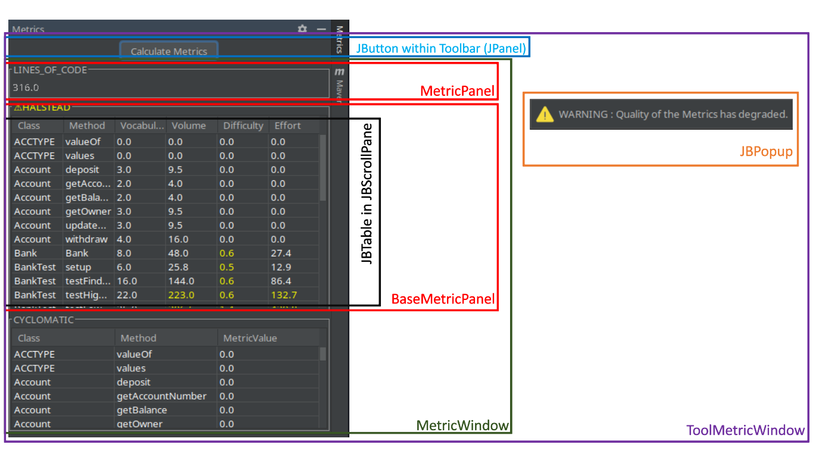


##### Calculate, save metric values

To calculate the metric, the user has to press the button 'Calculate Metrics' at the top of the MetricWindow. When pressed, the metrics are calculated as describe in the section 2.2.5 (Warning System).

The calculated values are then displayed in the respective `MetricPanel` and `BaseMetricPanel`.

##### Hovering description

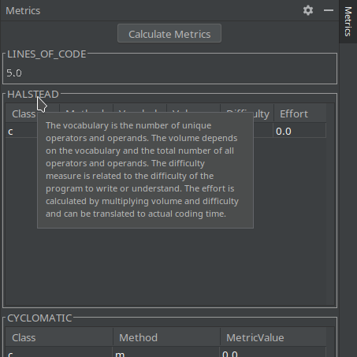

When the user puts its mouse over the name of a metric, a short description will be shown. The descriptions are stored inside the class `MetricDescription` and can be obtained by calling ` MetricDescription.get(Metric.Type type)`. The hovering is implemented by calling the following function in the constructor of `MetricPanel`.

```java
        panel.setToolTipText(MetricDescription.get(this.type));
```

#### 2.3.2 Metric Panel

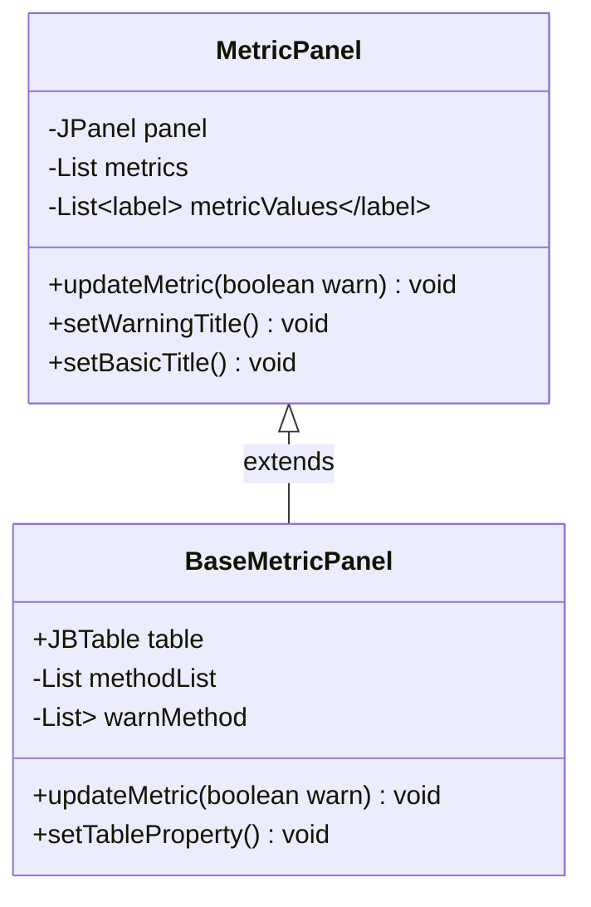
```mermaid
classDiagram
    
    
	class MetricPanel {
		-JPanel panel
        -List<Metric> metrics
        -List<Label> metricValues
        
        +updateMetric(boolean warn) void
        +setWarningTitle() void
        +setBasicTitle() void
    }
    
    class BaseMetricPanel {
        +JBTable table
        -List<PsiMethod> methodList
        -List<Set<Psimethod>> warnMethod
        
        +updateMetric(boolean warn) void
        +setTableProperty() void
    }
    
    MetricPanel <|-- BaseMetricPanel : extends

```

##### Structure
`MetricPanel` is simple single panel for displaying single Metric value. It use Label for show meticValue.
`BaseMetricPanel` is more complicated panel for dispaying __BaseMetric__ value. It has multiple value, so it sue JBTable instead of single Label.
`updateMetric` is invoked when Metric is re-calculated.
Each cell of Table is rendered by rendingFunction, and navigation use mouseClickListener of table. `setTableProperty` set this function to Table.

##### Algorithm
###### updateMetric
```java
       for (Pair<String, PsiMethod> key : tableRowMap.keySet()) {
            String aClass = key.first;
            PsiMethod aMethod = key.second;

            List<Double> listValues = tableRowMap.get(key);
            Object[] rowData = new Object[2 + listValues.size()];
            rowData[0] = aClass;
            rowData[1] = aMethod.getName();
            for (int i = 0; i < listValues.size(); i++) {
                rowData[i + 2] = metricValueFormatter.format(listValues.get(i));
            }
            tableModel.addRow(rowData);
            methodList.add(aMethod);
        }
```
After calculating, MetricPanel just get the Metric value as Map sturcture (PsiClass, <PsiMethod, Double>). using for loop we make row of table. Panel can display every Metric value for each method/class.

###### Warning
```java
@Override
public Component getTableCellRendererComponent(JTable table, Object value, boolean isSelected, boolean hasFocus, int row, int column) {
        ...
        Set<PsiMethod> compareList = warnMethod.get(column - 2);
        setWarn = compareList.contains(target);
        ...
        if (setWarn) {
            c.setForeground(Color.YELLOW);
        } else {
            c.setForeground(Color.WHITE);
        }
        ...
    }
```
If warning occurs, Panel set the title of Metric as warning title by `setWarnTitle`.
Also after getting degradingMetrics from BaseMetric, and store corresponding PsiMethod as List. In the CellRenderer, each cell check PsiMethod they contains is degrading Method. Then change the text of cell color by that result.


###### Navigation
```java
@Override
public void mouseClicked(MouseEvent e) {
    int row = table.rowAtPoint(e.getPoint());
    if (!methodList.isEmpty()) {
        PsiJvmMember codePart = methodList.get(row);
        codePart.navigate(true);
    }
}
```
In `updateMetric`, we store (row, PsiMethod) for find corresponding PsiMethod by row of cell.
We added mouseListener to table cell. If cell is clicked, first get row of cell be clicked. And use PsiJvmMember to navigate that code part.

#### 2.3.3 MetricWindow

The `MetricWindow` is a collection of `MetricPanel` displayed in a vertical layout. The `MetricPanel`. All the different MetricPanels are instanciated inside the `MetricWindow` constructor.

The `MetricWindow` implements the Singleton Pattern. Thus only one instance of this class exists in the whole project. This instance can be acquired by calling the `getInstance(...)` function.

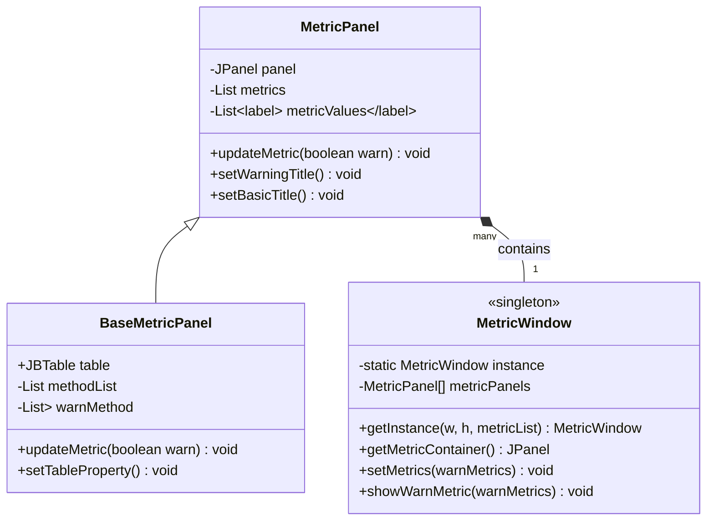
```mermaid
classDiagram
    
    class MetricWindow {
        <<singleton>>
        -static MetricWindow instance
        -MetricPanel[] metricPanels
        
        +getInstance(w, h, metricList) MetricWindow
        +getMetricContainer() JPanel
        +setMetrics(warnMetrics) void
        +showWarnMetric(warnMetrics) void
    }
    	class MetricPanel {
		-JPanel panel
        -List<Metric> metrics
        -List<Label> metricValues
        
        +updateMetric(boolean warn) void
        +setWarningTitle() void
        +setBasicTitle() void
    }
    
    class BaseMetricPanel {
        +JBTable table
        -List<PsiMethod> methodList
        -List<Set<Psimethod>> warnMethod
        
        +updateMetric(boolean warn) void
        +setTableProperty() void
    }
    
    MetricPanel <|-- BaseMetricPanel
    MetricPanel "many" *-- "1" MetricWindow : contains
```

The `MetricWindow` constructor creates the different MetricPanels:
```java
public MetricWindow(int width, int height, Map<Metric.Type, Metric[]> metricList) {
        // We use a container to allow scrolling
        metricContainer = new JPanel();
        metricContainer.setLayout(new BoxLayout(metricContainer, BoxLayout.PAGE_AXIS));
        metricPanels = new MetricPanel[Metric.Type.values().length];

        MetricPanel codeLinePanel = new MetricPanel(..., Metric.Type.LINES_OF_CODE);
        metricPanels[0] = codeLinePanel;
        metricContainer.add(codeLinePanel.getPanel());

        BaseMetricPanel halsteadPanel = new BaseMetricPanel(..., Metric.Type.HALSTEAD, new String[]{"Vocabulary", "Volume", "Difficulty", "Effort"}, false);
        metricPanels[1] = halsteadPanel;
        metricContainer.add(halsteadPanel.getPanel());

        BaseMetricPanel cycloPanel = new BaseMetricPanel(..., Metric.Type.CYCLOMATIC, new String[]{"MetricValue"}, true);
        metricPanels[2] = cycloPanel;
        metricContainer.add(cycloPanel.getPanel());

        MetricPanel miPanel = new MetricPanel(..., Metric.Type.MAINTAINABILITY);
        metricPanels[3] = miPanel;
        metricContainer.add(miPanel.getPanel());
}
```
`MetricWindow` contains the functions `setMetrics(ArrayList<Metric.Type> warnMetric)` and `showWarnMetric(Metric.Type[] warnMetrics)`. The first one allows to update the metrics values, while the second display a warning titles. Both call `MetricPanel` functions to do the job.

#### 2.3.4 ProjectToolWindow

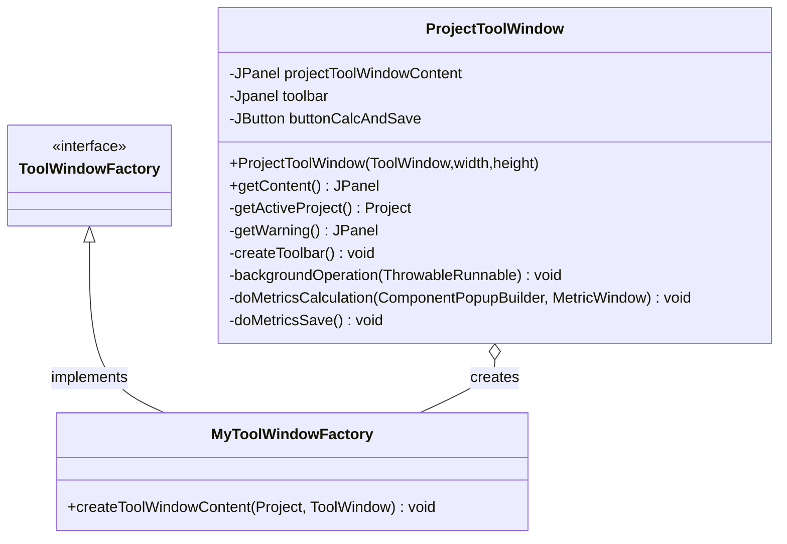
```mermaid
classDiagram
    class ToolWindowFactory
        <<interface>> ToolWindowFactory
    
    class MyToolWindowFactory {
        +createToolWindowContent(Project, ToolWindow) void
    }
    
    class ProjectToolWindow {
        -JPanel projectToolWindowContent
        -Jpanel toolbar
        -JButton buttonCalcAndSave
        +ProjectToolWindow(ToolWindow,width,height)
        +getContent() JPanel
        -getActiveProject() Project
        -getWarning() JPanel
        -createToolbar() void
        -backgroundOperation(ThrowableRunnable<?>) void
        -doMetricsCalculation(ComponentPopupBuilder, MetricWindow) void
        -doMetricsSave() void
    }
    
    ToolWindowFactory <|-- MyToolWindowFactory : implements
    ProjectToolWindow o-- MyToolWindowFactory : creates
```

`MyToolWindowFactory` creates the instance of `ProjectToolWindow`. The `ProjectToolWindow` is the container class of our plugin window. It contains the components (i.e. toolbar, metric window) of the UI, and is triggering the calculation of the software metrics.

## 3. Appendix

### 3.1. Environment

> **💡 Note on Gradle Wrapper**
> It invokes a declared version of Gradle (version declared as property in `team2_project/gradle/wrapper/gradle-wrapper.properties`) and downloads it if necessary.

In order to run our plugin the following system requirements are needed:

- OS: Ubuntu 20.04, 21.04; MacOS; Windows 10
- Java version : jdk11 (corretto-11 or OpenJDK11)
- Gradle version: as specified in gradle-wrapper, 7.*


### 3.2. CI

#### 3.2.1 Structure

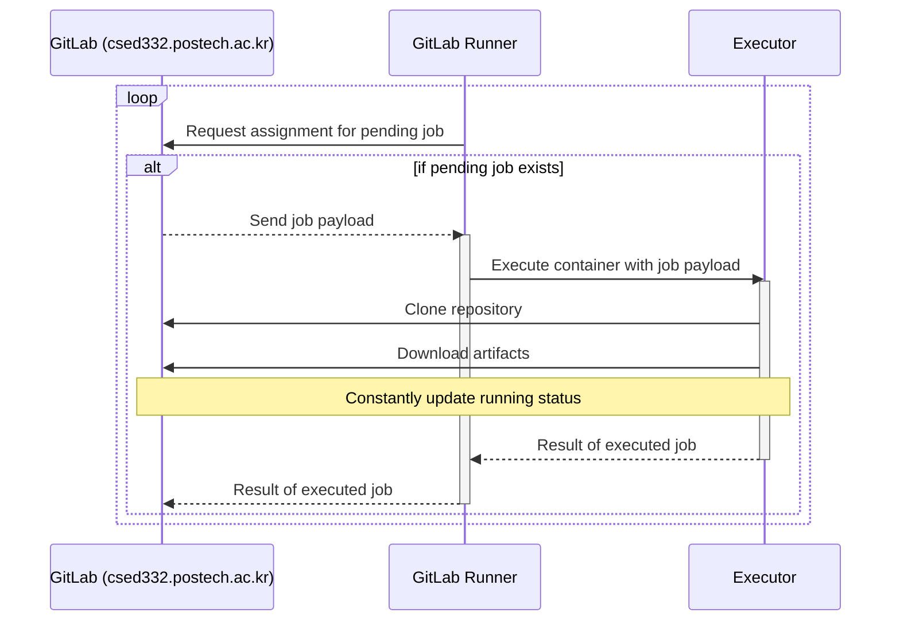
```mermaid
sequenceDiagram
    participant G as GitLab (csed332.postech.ac.kr)
    participant R as GitLab Runner
    participant E as Executor
    loop
        R->>G: Request assignment for pending job
        alt if pending job exists
            G-->>R: Send job payload 
            activate R
            R->>E: Execute container with job payload
            activate E
            E->>G: Clone repository
            E->>G: Download artifacts
            Note over G, E: Constantly update running status
            E-->>R: Result of executed job
            deactivate E
            R-->>G: Result of executed job
            deactivate R
        end
    end
```

We installed GitLab Runner on a remote server to introduce CI to our project. Our GitLab Runner, registered to our project on the GitLab server, continuously queries whether there are pending jobs for the project. If there is a pending job, it runs the docker container in terms of the project's configuration. After execution, the runner delivers the results of each pipeline to the GitLab server. Finally, we can see the results of CI via browsers.


#### 3.2.2. Automated Test

```yaml
test:
  stage: test
  script:
    - ./gradlew check jacocoTestReport
```

Automating test execution is essential for successful integration. It is a crucial factor in Extreme Programming to make the latest source code always work correctly. Various factors can ruin the code, such as a merge conflict or incorrect implementation. To guarantee the homeostasis of the code despite multiple factors and diverse situations, we introduced CI to the project. Our CI automatically performs unit tests for each pushed code and written merge request. More specifically, our CI runs `gradle check jacocoTestReport` on the pushed code with gradle wrapper. It determines whether the test passes or not. Our CI helps Extreme Programming by ensuring that the code in the repository always runs correctly.


#### 3.2.3. Deploy Artifact

```yaml
test:
  # ...
  artifacts:
    when: always
    paths:
      - team2_project/build/reports/jacoco/test/jacocoTestReport.xml
    reports:
      junit: team2_project/build/test-results/test/**/TEST-*.xml
```

Our CI automatically performs tests, but this doesn't mean our code always passes the tests. In other words, there is always a risk that the test will fail. When a test fails, developers should be able to see why the test failed. For this, CI deploys results as artifacts. CI saves `jacocoTestReport.xml` and `TEST-*.xml` in the test stage and deploys them as artifacts. In addition, since GitLab parses the JUnit test result, developers can view the test result more conveniently with browsers.


#### 3.2.4. Visualize Artifact

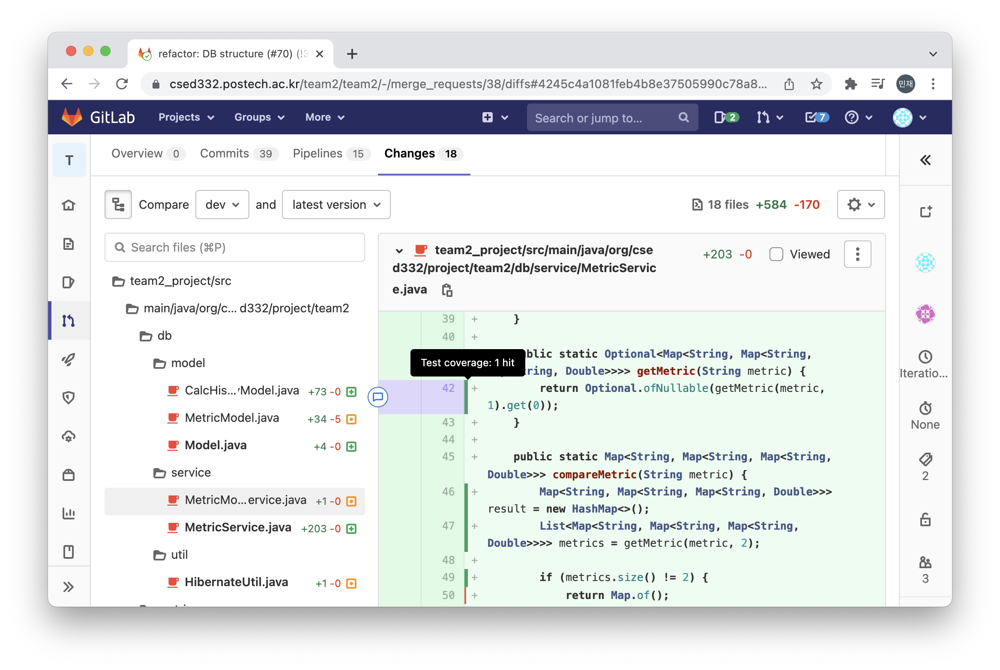
```yaml
coverage:
  stage: visualize
  image: registry.gitlab.com/haynes/jacoco2cobertura:1.0.7
  script:
    - python /opt/cover2cover.py build/reports/jacoco/test/jacocoTestReport.xml $CI_PROJECT_DIR/team2_project/src/main/java/ > build/cobertura.xml
  needs: ["test"]
  artifacts:
    reports:
      cobertura: team2_project/build/cobertura.xml

```

To provide richer information about each Merge Request, our CI includes the ability to visualize code coverage. Visualize stage in our CI uses the `jacocoTestReport` artifact created in the test stage. In this stage, CI runs Cobertura, which uses `jacocoTestReport` as its input. After it runs, GitLab parses reports generated through Cobertura. Thanks to GitLab, developers can see whether their code is covered or not in the "Changes" tab of each Merge Request.


### 3.3. Automated Test

#### 3.3.1. Database

##### MetricServiceTest

Unlike other tests, we implemented several helper methods to handle data in database for tests.
```java
static {
    metricModelList = new ArrayList<>();
    calcHistoryModelList = new ArrayList<>();
}

@AfterEach
public void afterEach() {
    // ...
        for (CalcHistoryModel c : calcHistoryModelList) {
            session.remove(c);
        }
        session.getTransaction().commit();
    // ...
    metricModelList.clear();
    calcHistoryModelList.clear();
}
```
Like above, the data created during the test is removed after the test. So database remains consistent regardless of testing.

```java
private CalcHistoryModel generateCalcHistoryModel() {
    CalcHistoryModel c = MetricService.generateCalcHistoryModel(UUID.randomUUID().toString());
    calcHistoryModelList.add(c);
    return c;
}

private MetricModel generateMetricModel(CalcHistoryModel c) {
    MetricModel m = MetricService.addMetric(c.getMetric(),
            UUID.randomUUID().toString(), ...);
    metricModelList.add(m);
    return m;
}
```
There are also generator methods for `MetricModel` and `CalcHistoryModel`. Some of them uses `UUID` for creating arbitrary name like above.

```java
@Test
public void testGenerateCalcHistoryModel() {
    CalcHistoryModel c = generateCalcHistoryModel();
    Assertions.assertNotNull(c);
}

@Test
public void testAddMetric() {
    CalcHistoryModel c = generateCalcHistoryModel();
    MetricModel m = generateMetricModel(c);
    Assertions.assertNotNull(m);
}
```
Test code for database checks four main functionalities of `MetricService`, explained in *2.1.2 Service*. On `testAddMetric()`, we only checked whether the add method worked without any error and returned safely. We check whether it really added the data correctly to database on `testGetMetric()` and `testCompareMetrics()`.

#### 3.3.2. Metric

##### CodeLineMetricTest

```java
@Test
public void testProjectCodeLineMetricCalculateNoPackages() {
    //...
    Assertions.assertEquals(0.0, projectCodeLineMetric.calculate());
}
    
@Test
public void testClassCodeLineMetricCalculate() {
    // ...
}

@Test
public void testDBConnection() {
    // ...
}
```
This test class is for `CodeLineMetric` class. The first two tests check whether two `CodeLineMetric` objects calculate the number of lines of code in a project and a class. `testDBConnection` test checks if a `CodeLineMetric` object sends the data in the form as we expected. This test also checks if the `set()` method, which is responsible for setting the value of a field named `codeLine`, works correctly.

##### CyclomaticTest
```java
@Test
public void testIFCycloMatic() {
    //...
    Assertions.assertEquals(1.0, metrics.get(methods.get("singleIF")));
    Assertions.assertEquals(1.0, metrics.get(methods.get("singleIfElse")));
    Assertions.assertEquals(3.0, metrics.get(methods.get("nestedIF")));
    Assertions.assertEquals(3.0, metrics.get(methods.get("multiElseIf")));
}
    
@Test
public void testAssertCycloMatic() {
    // ...
}
    
@Test
public void testSave() {
    // ...
}
```
This test class checks if the `CycloMetric` class correctly. Most of the test methods checks if a `CycloMetric` object correctly calculates the value of a method with several conditional statements. We defined these statement as branch:

> - IF / ELSE-IF
> - For / ForEach
> - Switch-case (except default)
> - Try-catch
> - Assert
> - While/do-while
> - Conditional operator (tenary operator)

It is because cyclomatic complexity depends on the number of branches in a method. The `testSave()` test checks if the `save()` method in a `CycloMetric` object saves the value to database in the way we intended.

We created testcase not only check single branch statement but also nested statement or statement combined with other statement such as block, assign, etc.

##### Halstead Package Tests

###### HalsteadMetricCalculatorTest

```java
HalsteadMetricCalculator halsteadMetricCalculator = 
    new HalsteadMetricCalculator(10, 3, 20, 5);

@Test
public void calculateVocabulary() {
    Assertions.assertEquals(8, halsteadMetricCalculator.getVocabulary());
}

@Test
public void calculateSize() {
    Assertions.assertEquals(30, halsteadMetricCalculator.getSize());
}

// ...
```
This test class checks if the fields in `HalsteadMetricCalculator`, such as number of unique(or total) operators and operands, are calculated in the way we intended. These fields are used to calculate halstead complexity in `HalsteadMetric` class.

###### HalsteadParserTest
```java
@Test
public void parseMethodOneOperator() throws Exception {
    // ...
    halsteadParser.parse(psiMethod);

    Assertions.assertEquals(8, halsteadParser.getHalsteadVisitor().getNumberOfTotalOperands());
    Assertions.assertEquals(8, halsteadParser.getHalsteadVisitor().getNumberOfUniqueOperands());
}
    
@Test
public void parseMethodSimpleAddition() throws Exception {
    // ...
}
    
@Test
public void parseMethodMainClass() throws Exception {
    // ...
}
```
This test class checks if `HalsteadParser` class correctly parses several methods with several kinds of operators and operands. One method has the initialization of two variables. Another has a addition of variables in addition. The other has a method call named `System.out.println()`.

###### HalsteadMetricTest
```java
@Test
public void parseMethodOneOperator() throws Exception {
    // ...
}

@Test
public void testSave() throws Exception {
    // ...
}
```

This test class checks if `HalsteadMetric` class works correctly. The `parseMethodOneOperator` test checks if a `HalsteadMetric` object caculates several factors used to cacluate halstead complexity in the way we intended. These factors are vocabulary, difficulty, effort, and volume. The `testSave()` method tests saving the data to a database.

##### BaseMetricDegradationTest
```java
@Test
public void testGetDegradationMetrics() {
    //...
    baseMetric.setMetric(1.5, psiClass.getName(), psiMethod);
    baseMetric.save(calc);
    baseMetric.setMetric(2.0, psiClass.getName(), psiMethod);

    degradationMetrics = baseMetric.getDegradedMetrics();
    Assertions.assertEquals(degradationMetrics.keySet(), Set.of(psiClass.getName()));
}
    
@Test
public void testGetDegradationMetricsMultiple() {...}
    
@Test
public void testGetDegradationMetricsNoWarningOneClass() {...}
```
This test class is for `getDegradedMetrics()` and `checkDegradation()` methods in `BaseMetric` class. The condition of the `BaseMetric` object is set to `INCREASE`, which checks if the value increased compared to the prevous value stored in database. Thus, in every test, the `save()` method is called exactly once, between the first values and second values. The `getDegradedMetrics()` method is tested in various situations, one with a class and a method, the others with multiple classes and methods. The `checkDegradation()` method is also tested, given the condition that returned `Map` object of `getDegradedMetrics()` is empty or not.

#### 3.3.3. warning
##### WarningConditionTest
```java
@Test
public void increasePositiveTest() {
    Assertions.assertTrue(w_incr.shouldWarn(0, 1));
}

@Test
public void increaseNegativeTest() {
    Assertions.assertFalse(w_incr.shouldWarn(1, 0));
    Assertions.assertFalse(w_incr.shouldWarn(0, 0));
}

@Test
public void decreasePositiveTest()
```
This test code test all four modes of conditions of `WarningCondition`. Checks both correct and incorrect input and output. Test name with "teta" tests if `INCREASE` condition works well with teta set.

#### 3.3.4. Util
##### FixtureHelper
```java
public PsiFile getPsiFile() {
    return fixture.getFile();
}

public PsiClass getFirstPsiClass() {
    PsiFile psiFile = this.getPsiFile();
    ...
    return psiClass;
}

public PsiClass getPsiClass(String Name) {
    PsiFile psiFile = this.getPsiFile();
    ...
    for (PsiClass aClass : classes) {
        if (aClass.getName().equals(Name)) {
            return aClass;
        }
    }
    return classes[0];
}
```
Our project analysis give project code and caculate Metric value. when backend run, they use Psi library for accessing component of project.
To automated test, we have to make virtual java file and give the input to test as `Project` or `PsiClass`.

Therefore, we have used `codeInstightTestFixture` for automated test.
This class is not test code, but helper class for metric tests by using testFixture. This class allows other tests code to access example code file so that we can calculate metric and check if they work well.

In resource directory, there are various target test code for automated test.

### 3.4. Manual Test

Our manual test cases follow this format:
* **Preconditions**
    * what the state of the system needs to be before starting the test case
* **Steps**
    * describe how to execute test case in small steps
* **Expected Result**
    * after each step, there is an expected result

For running manual test cases, consider the system requirements stated in 3.1.


#### 3.4.1. Smoke Test - Plugin loads & panel is displayed

##### Preconditions:
* run 'clean' of Gradle
    * `./gradlew clean`
* run 'runIde' of Gradle
    * `./gradlew runide`


##### Steps:
1. open any project
2. open plugin panel "Metrics"
3. hover over name of metrics


##### Expected Results:
1. plugin panel "Metrics" is visible as in the following screenshot on the right:
   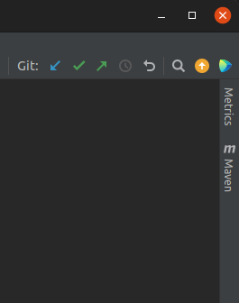

2. Toolbar with Buttons is visible; Metric Panels are shown (not necessarily with values)
   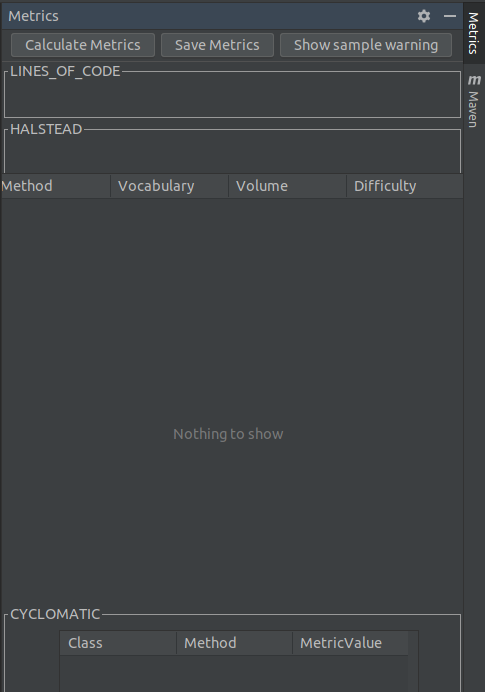


3. Tooltip shows with description of metrics
   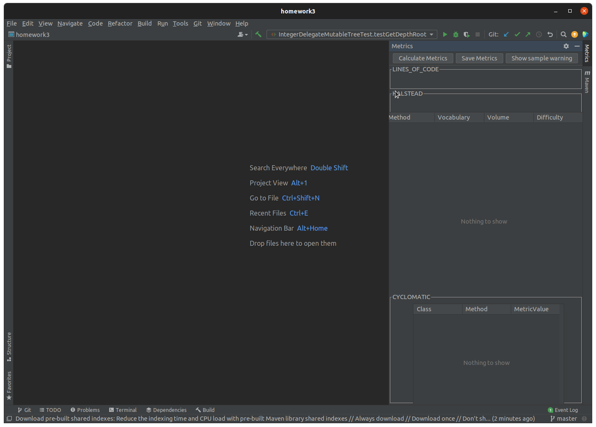

#### 3.4.2. Compare Metrics & Send Warning
##### Preconditions:
* run 'clean' of Gradle
    * `./gradlew clean`
* run 'runIde' of Gradle
    * `./gradlew runide`
* open empty project with one empty class (In a new package)
* open plugin panel "Metrics"


##### Steps:
1. Create a new class in a new package
2. Push the calculate button
3. Add new lines of code to this class (until there is 100 lines in the 4. class, the ending bracket will be at line 101)
4. Push the calculate button

##### Expected Results:

1. After the first calculation (step 2), the total number of line displayed should be 2.
   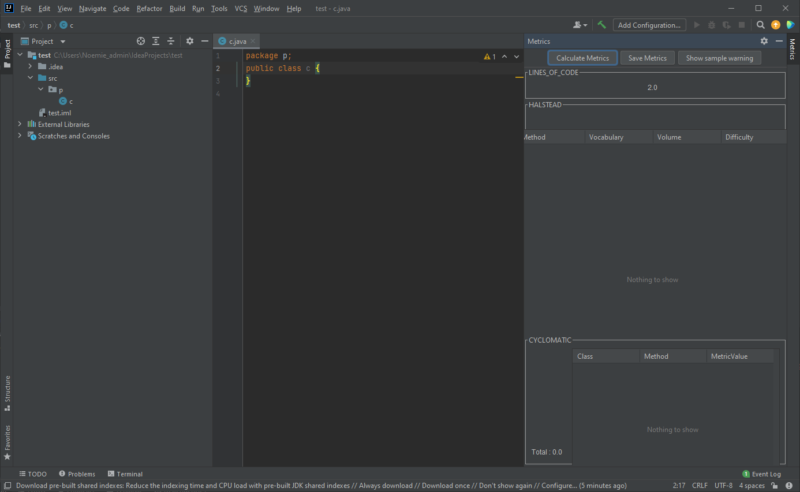


2. After the second calculation (step 4), the total number of line displayed should be 100. Moreover the title of the total code line should switch from no warning to indicating that the metric has worsen (yellow title, warning sign)
   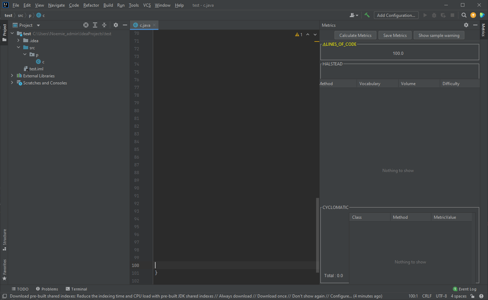


#### 3.4.3. Calcluate Halstead Metric & Cyclomatic Metric
##### Preconditions:
* run 'clean' of Gradle
    * `./gradlew clean`
* run 'runIde' of Gradle
    * `./gradlew runide`
* open any, non-empty and not too heavy project

##### Steps:
1. open plugin panel "Metrics"
2. click button "calculate metrics"

##### Expected Results:
1. panel opens and shows section for lines of code, halstead metrics & cyclomatic complexity
2. All metrics are calculated (halstead metrics & cyclomatic complexity is displayed per class and method)
   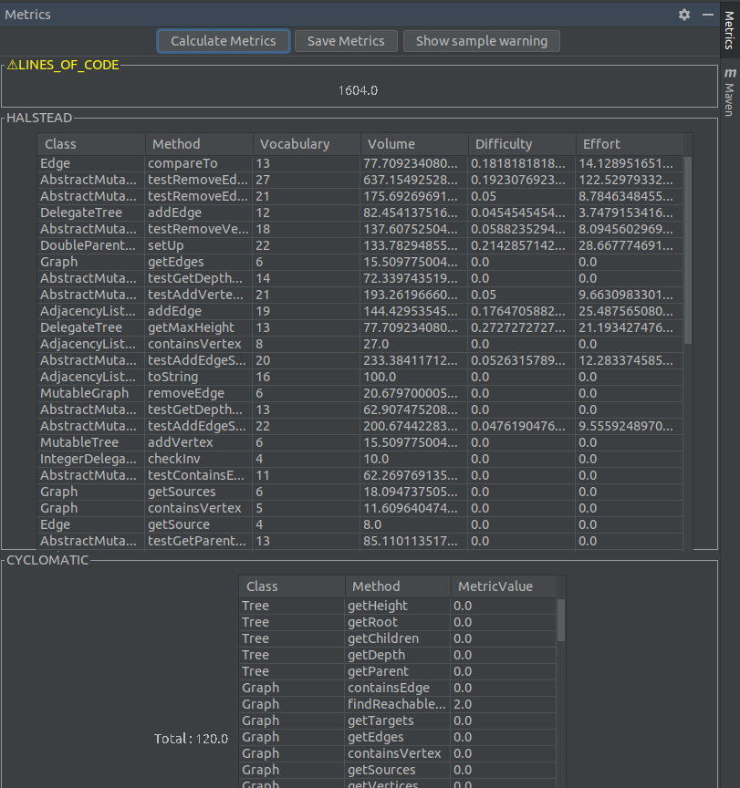


#### 3.4.4. Warning On Cyclomatic Metric
##### Preconditions:
* run 'clean' of Gradle
    * `./gradlew clean`
* run 'runIde' of Gradle
    * `./gradlew runide`
* open empty project with one empty class (in a new package)
* open plugin panel "Metrics"

##### Steps:
1. Add this method to the class.
    ```java
    int m() {
        int a = 1;
    }
    ```

2. Push the 'calculate Metrics' button,
3. Add 15 successive condition statements `if (a==2);` in the method.
4. Push the 'calculate Metrics' button

##### Expected Result:
1. After 2, one entry should exists for the Cyclometric Metric. It's value should be of 1.0. It should be written in white. See image.

   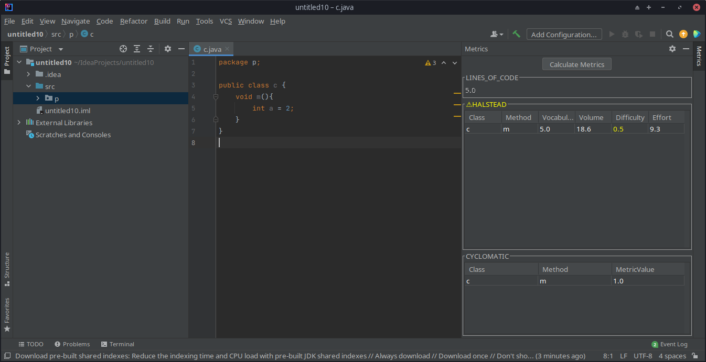

2. After 4. one entry should exists for the Cyclometric Metric. It's value should be 16.0. It should be written in yellow font. See image.

   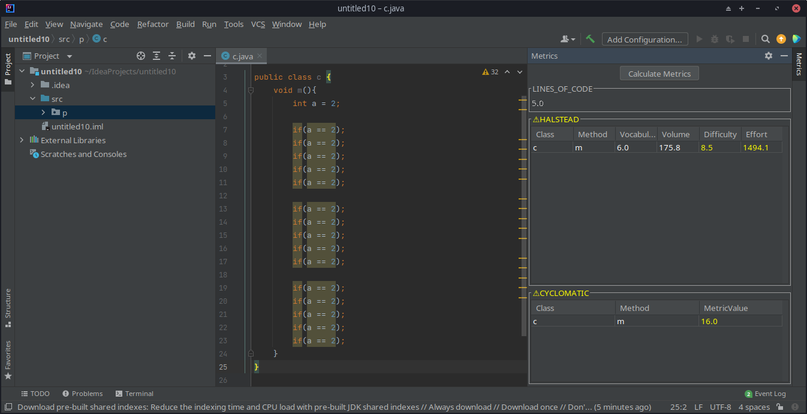


#### 3.4.5. Warning on Halstead Metric
##### Preconditions:
* run 'clean' of Gradle
    * `./gradlew clean`
* run 'runIde' of Gradle
    * `./gradlew runide`
* open empty project with one empty class (in a new package)
* open plugin panel "Metrics"

##### Steps:
1. Create a method 'm'.
2. Push the 'calculate Metrics' button,
3. Replace the 'm' method by the following code. Import classes if needed.
    ```java
    void m() throws IOException {
        Scanner scan = new Scanner(System.in);
        System.out.println("What is the answer?");
        int answer = scan.nextInt();
        if(answer == 42)
            System.out.println("You are right!");
        else
            System.out.println("You are wrong!");
    }
    ```
4. Push the 'calculate Metrics' button


#### Expected Result:
1. After 2, one entry should exists for the Halstread Metric.The values should be identical to the ones in the image. It should be written in white. See image.
   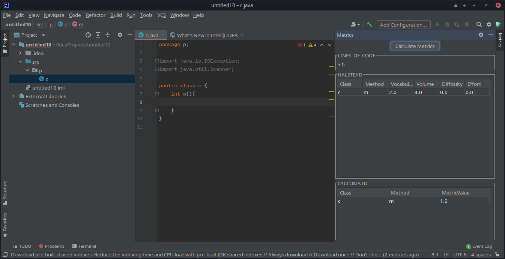

2. After 4. one entry should exists for the Halstread Metric.The values should be identical to the ones in the image. The difficulty and effort of that entry should be written in yellow font. See image.
   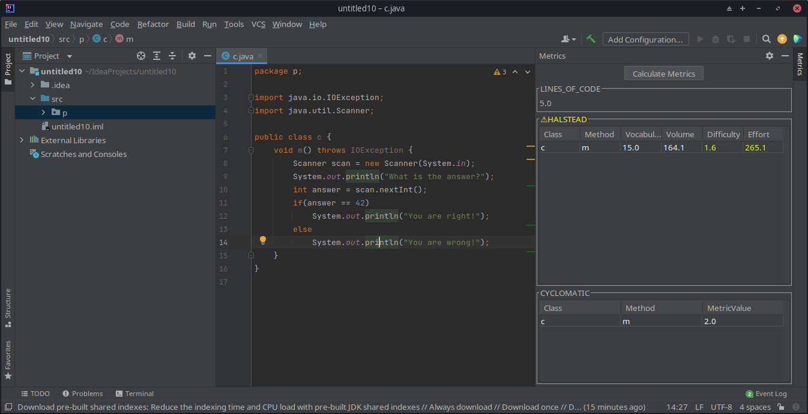


